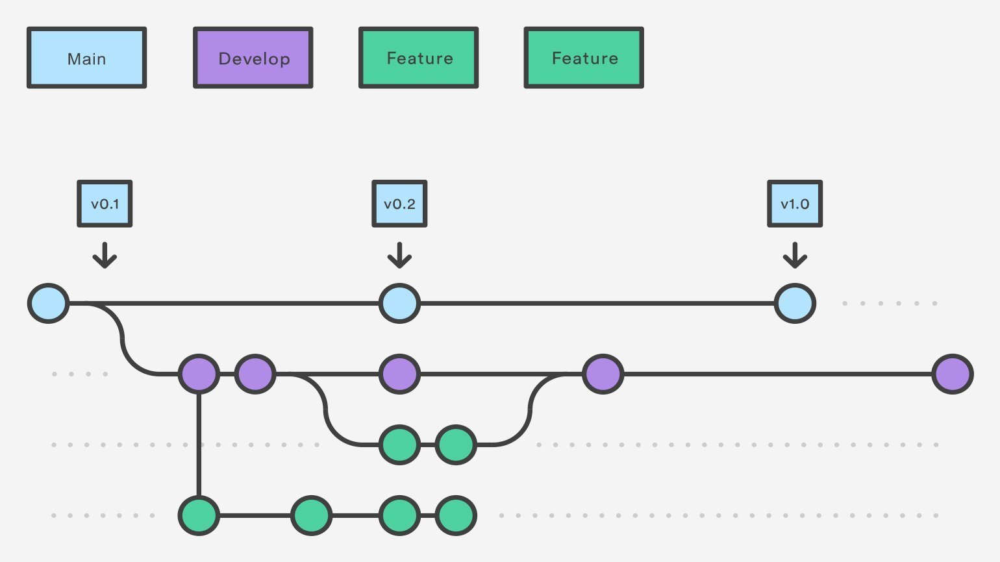
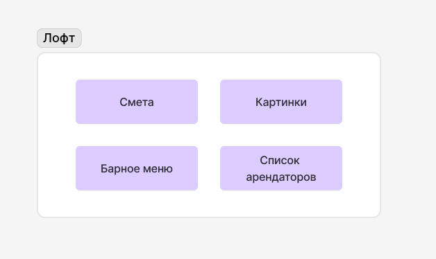
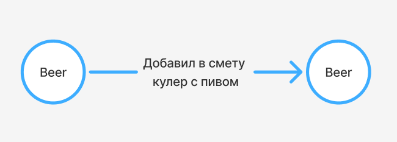
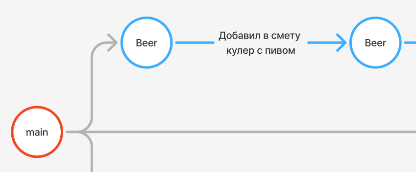
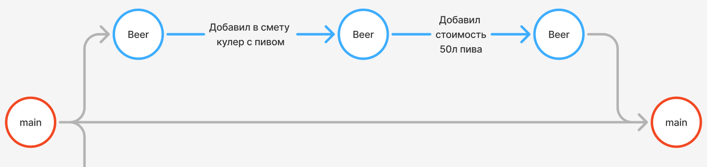
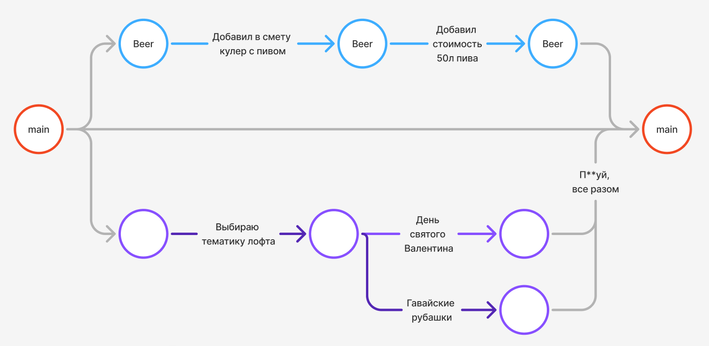
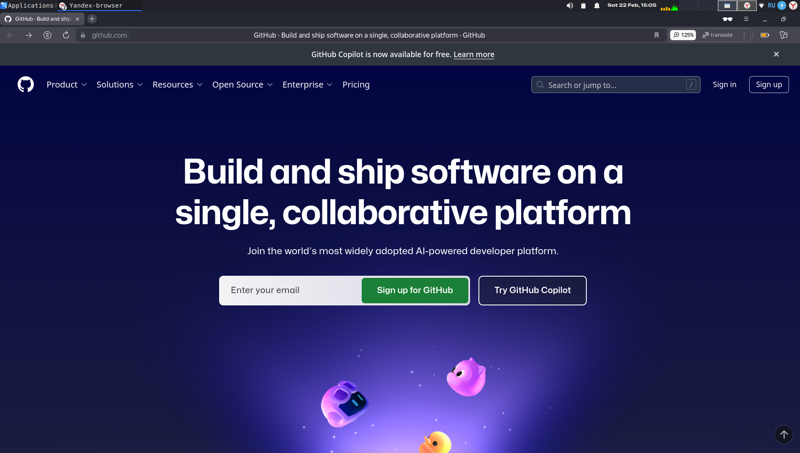
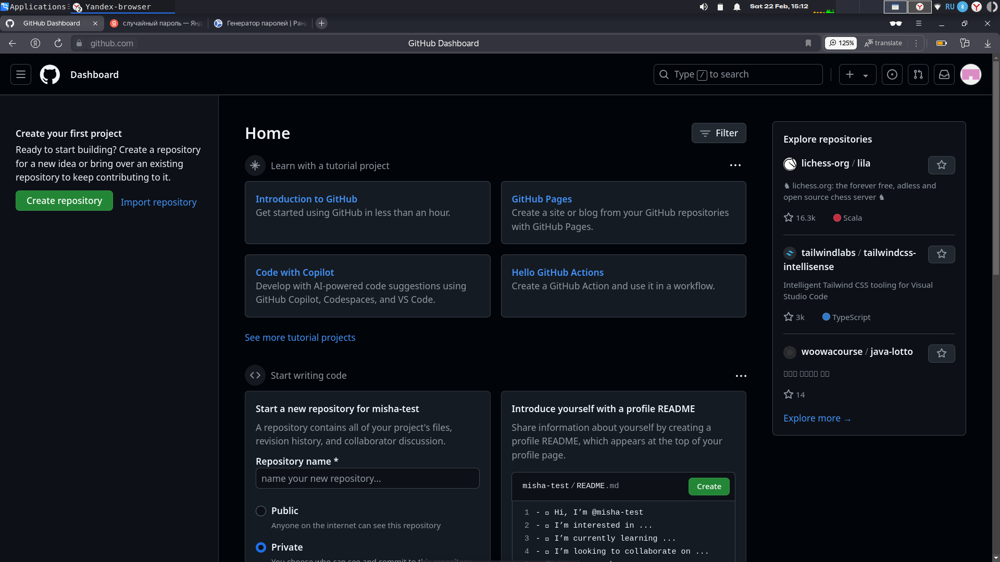

# Введение в Git для экономистов
Принцип такой - я рассказываю какие проблемы он решает, а не "посмотрите, есть такая чтука, давайте использовать"
### План занятий:
1. [Введение. Что это такое и какие проблемы решает](#Введение. Что это такое и какие проблемы решает)
2. [Основные понятия и примеры](#Основные понятия и примеры)
3. [Настраиваем все нужное](#Настраиваем все нужное)
4. Практика!

## Введение. Что это такое и какие проблемы решает

> __"Я создал Git, потому что буквально ненавижу общаться с людьми"__
> Линус Торвальдс

Формально Git это распределенная система контроля версий. Если проще - чтука для совместного ведения проектов

Это как "История изменений" в Word/Google Docs, только для всех видов файлов (не только документы)

С помощью Git-a вы можете откатить свой проект до более старой версии, а также сравнивать, анализировать или обьединять свои изменения
### Какие проблемы решает?
- С Git вы не потеряете никакие сохранения
- Сможете эффективно работать над общим проектом (даже в большой команде)
- Сможете без опасений реализовывать различные ветки решений и обьединять их

Благодаря этому, Git используют во всех крупных компаниях, поэтому им обязательно нужно уметь владеть
# Основные понятия и примеры
- Ваш проект хранится в __репозитории__
- Каждая точка сохранений вашего проекта называется __коммитом (commit)__
- Последовательность коммитов образуют __ветки__ (branches)
- И запросы на обьединение (слияние) этих веток, называются **pull request**

Например, вы хотите организовать лофт

Для этого создаете репозиторий лофта, где будут хранится: смета, нужные картинки, барное меню и так далее

Пусть некий __Михаил__ решил обновить смету, добавив в неё кулер с пивом

Для этого он обновил файлик со сметой на своем компьютере, а после этого создал коммит с описанием "Добавил в смету кулер с пивом" и отправил изменения в репозиторий

Пообщавшись с другими организаторами, Миша понял что недоработал смету с кулером пива и в целом там много работы (Забыл учесть стоимость пива), поэтому создал отдельную ветку разработки "Beer Feature"

После того как он учел стоимость пива, он отправил Лиле **запрос на слияние** веток "Beer Feature" и "Main", который она с радостью приняла!

После чего, у всех участников проекта обновилась смета. Вообще параллельно с этим, независимо от Миши, организаторы обновили и добавили много других файлов

За счет ветвления проекта, никто никому не помешал (если конечно не случилось конфликтов слияния хехе) и все параллельно работали над общими файлами
# Настраиваем все нужное
Скачаем теперь себе Git на компьютер, зарегистрируемся на GitHub и установим GitHub Desktop чтобы не в консоли писать команды, а нажимать на красивые кнопочки
## Регистрируемся на GitHub
ес че [тут](https://github.com)

Нажимаем на кнопочку **Sign Up** и попадаем на страничку регистрации. Доказываем компьютеру что мы не робот и подтверждаем Email. Итогом вы оказываетесь на следующей странице:

Теперь скачаем Git и GitHub-Desktop
## Скачиваем Git на Windows
Открываем [эту](https://git-scm.com/downloads/win) страничку и нажимаем на нужную кнопочку
.png)

Открываем, далее -> далее -> далее -> далее -> далее -> ... -> установить 

для MacOS ничего скачивать не нужно, он у вас уже установлен )

Теперь открываем __GUI Clients__ (Графические клиенты Git) чтобы скачать GitHub-Desktop

.png)

